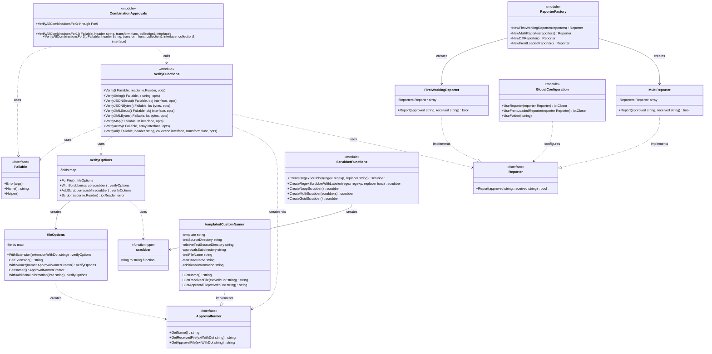

# ApprovalTests Go Architecture

## Overview

This diagram shows the core architecture of the ApprovalTests Go library, focusing on the main interfaces, core methods, and key components that make up the system.

## Architecture Diagram

## Component Descriptions

### Core Interfaces

- **Failable**: Abstraction over testing.T, provides test failure and naming capabilities
- **ApprovalNamer**: Manages the naming convention for approved and received files
- **Reporter**: Handles reporting when approval tests fail

### Configuration

- **verifyOptions**: Main configuration object for verification operations
- **fileOptions**: File-specific configuration options
- **scrubber**: Function type for data sanitization/scrubbing

### Verification

- **VerifyFunctions**: Core verification methods that form the main API
- **CombinationApprovals**: Specialized functions for testing combinations of inputs

### Reporters

- **FirstWorkingReporter**: Tries multiple reporters in sequence until one works
- **MultiReporter**: Runs multiple reporters simultaneously

### Naming

- **templatedCustomNamer**: Template-based implementation of ApprovalNamer

### Utilities

- **ScrubberFunctions**: Factory methods for creating various scrubber implementations
- **ReporterFactory**: Factory methods for creating reporter instances
- **GlobalConfiguration**: Global configuration functions for setting default reporters and folders

## Key Architectural Patterns

1. **Interface-based Design**: Core functionality is defined through interfaces (Failable, ApprovalNamer, Reporter)
2. **Options Pattern**: Flexible configuration through verifyOptions and fileOptions
3. **Strategy Pattern**: Different reporting strategies through Reporter interface
4. **Chain of Responsibility**: FirstWorkingReporter tries reporters in sequence
5. **Template Method**: templatedCustomNamer uses templates for file naming
6. **Functional Options**: scrubber as a function type allows flexible data transformation
